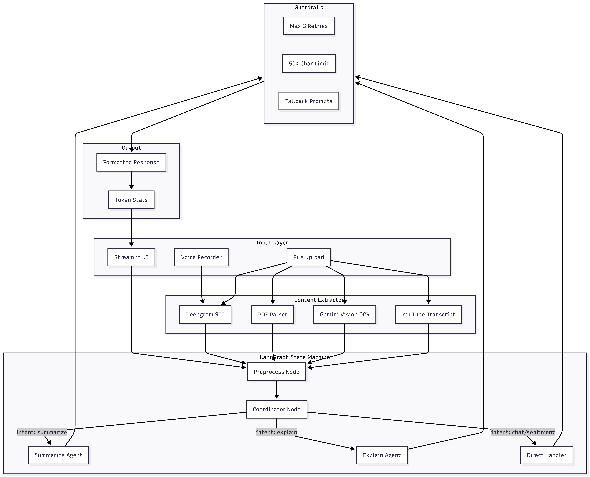

# 🤖 Datasmith AI

AI-powered document analysis assistant built with **LangGraph**, **Gemini**, and **Streamlit**.


## ✨ Features

- **📄 Document Processing** - PDF, TXT, Images (OCR via Gemini Vision)
- **🎵 Audio Transcription** - MP3, WAV via Deepgram Nova
- **🎥 YouTube Analysis** - Auto-extract transcripts from URLs
- **🎤 Voice Input** - Record and transcribe voice messages
- **📊 Token Tracking** - Real-time cost estimation and speed metrics

### AI Capabilities

| Feature | Description |
|---------|-------------|
| **Summarize** | TL;DR, key points, detailed summary |
| **Explain** | Break down code or documents |
| **Sentiment** | Positive/Negative/Neutral analysis |
| **Chat** | General Q&A about your content |

## 🚀 Quick Start

### Using Docker (Recommended)

```bash
# Clone and enter directory
git clone <repo-url>
cd datasmith-ai

# Create .env file
cp backend/.env.example backend/.env
# Edit backend/.env with your API keys

# Run
docker compose up --build
```

Open **http://localhost:8501**

### Manual Setup

```bash
# Install dependencies
cd backend
pip install -r requirements.txt

# Set environment variables
export GOOGLE_API_KEY=your_key
export DEEPGRAM_API_KEY=your_key

# Run
streamlit run main.py
```

## ⚙️ Configuration

Create `backend/.env`:

```env
GOOGLE_API_KEY=your_gemini_api_key
DEEPGRAM_API_KEY=your_deepgram_key
LLM_MODEL=gemini-2.0-flash
TEMPERATURE=0.3
```

### Supported Models

| Model | Rate Limit (Free) | Cost (per 1M tokens) |
|-------|-------------------|---------------------|
| `gemini-2.0-flash` | 15 RPM | $0.10 / $0.40 |
| `gemini-1.5-flash` | 15 RPM | $0.075 / $0.30 |
| `gemini-1.5-pro` | 2 RPM | $1.25 / $5.00 |

## 📁 Project Structure

```
backend/
├── main.py          # Streamlit UI
├── agent.py         # LangGraph coordinator agent
├── extractors.py    # PDF, audio, image, YouTube extractors
├── voice_chat.py    # Deepgram STT
├── pricing.py       # Token cost configuration
├── config.py        # Settings loader
├── schemas.py       # Data models
├── utils.py         # Helper functions
├── Dockerfile
└── requirements.txt
```

## 🏗️ Agentic Architecture



### Flow Description

| Step | Component | Description |
|------|-----------|-------------|
| 1 | **Input** | User provides text, file, voice, or YouTube URL |
| 2 | **Extract** | Content is extracted to plain text |
| 3 | **Preprocess** | LangGraph node normalizes input |
| 4 | **Coordinate** | LLM classifies intent with confidence score |
| 5 | **Route** | Conditional edge routes to appropriate agent |
| 6 | **Execute** | Specialized agent processes request |
| 7 | **Guard** | Guardrails handle errors and fallbacks |
| 8 | **Respond** | Formatted response with token stats |

## 🛡️ Guardrails

- **Rate Limit Handling** - Max 3 retries, clear error messages
- **Content Limits** - 50K character max to prevent token overflow
- **Fallback Prompts** - Simpler prompts when JSON parsing fails
- **Graceful Errors** - User-friendly messages for all failure modes

## 📊 Token Tracking

Real-time display of:
- Input/Output tokens
- Tokens per second
- Total processing time
- Estimated cost (USD)

## 🎤 Voice Input

1. Click the microphone icon
2. Speak your message
3. Recording auto-stops after 2 seconds of silence
4. Message is transcribed via Deepgram and processed

## 📝 License

MIT License - See LICENSE file

## 🤝 Contributing

1. Fork the repository
2. Create a feature branch
3. Submit a pull request

---

**Student Project** - Final Year AI/ML
